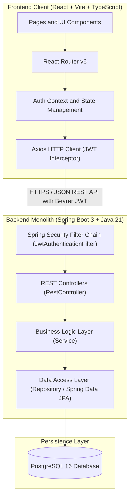
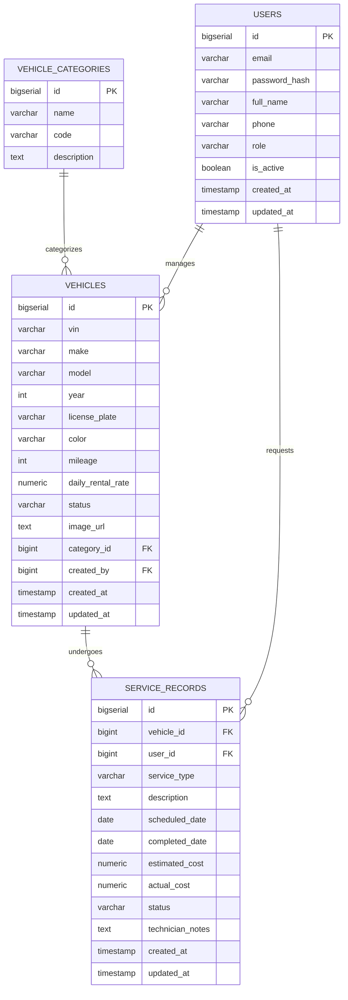
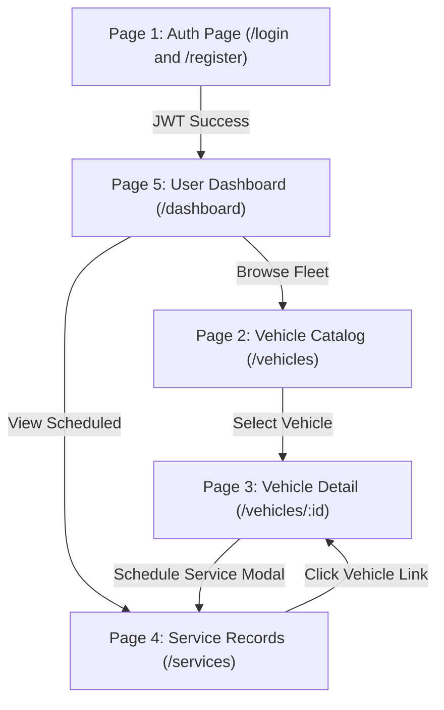

# FleetFlow — Vehicle Inventory & Maintenance Management System
## Complete Project Design & Technical Specification Document

**Project Name**: FleetFlow (Vehicle Management System)  
**Architecture**: Monolithic RESTful Architecture  
**Target Stack**:
- **Frontend**: React 18+, Vite, TypeScript, React Router v6, Axios, TailwindCSS / CSS
- **Backend**: Java 21, Spring Boot 3.3+, Spring Security 6 (JWT), Spring Data JPA, Hibernate, PostgreSQL 16
- **Database**: PostgreSQL 16 (Local / Docker Compose)

---

## 1. Executive Summary & Application Concept

### 1.1 Project Objective
FleetFlow is a streamlined vehicle fleet and maintenance tracking system designed to bridge inventory tracking with service scheduling. The system allows regular users (drivers or customers) to browse vehicle inventory, view vehicle specifications, and book service/maintenance appointments, while administrative users (fleet managers) can manage vehicles, track maintenance lifecycles, and update operational statuses.

### 1.2 User Roles & Permissions
- **`ROLE_USER`**:
  - Register, log in, log out, view own profile.
  - Browse, search, filter, and paginate the vehicle fleet.
  - View individual vehicle details and maintenance logs.
  - Book service appointments for vehicles.
  - View their own scheduled services on the dashboard.
- **`ROLE_ADMIN`**:
  - All `ROLE_USER` permissions.
  - Add new vehicles, update vehicle details, and retire/delete vehicles.
  - View all service appointments across the fleet.
  - Update service appointment status (`PENDING` → `IN_PROGRESS` → `COMPLETED` / `CANCELLED`).

---

## 2. System Architecture

### 2.1 High-Level Architecture Diagram



```text
+-----------------------------------------------------------------------------------+
|                        FRONTEND CLIENT (React + Vite + TS)                        |
|   [ Pages & Components ] ---> [ React Router ] ---> [ Axios Client (Bearer JWT) ] |
+-----------------------------------------------------------------------------------+
                                          |
                        HTTP / JSON REST API (Port 8080)
                                          |
                                          v
+-----------------------------------------------------------------------------------+
|                        BACKEND MONOLITH (Spring Boot 3 + Java 21)                 |
|   [ Spring Security (JWT Filter) ]                                                |
|          |                                                                        |
|          v                                                                        |
|   [ Controllers (@RestController) ]                                               |
|          |                                                                        |
|          v                                                                        |
|   [ Service Layer (@Service) ]                                                    |
|          |                                                                        |
|          v                                                                        |
|   [ Repositories (@Repository / Spring Data JPA) ]                                |
+-----------------------------------------------------------------------------------+
                                          |
                                    SQL Queries
                                          |
                                          v
+-----------------------------------------------------------------------------------+
|                        PERSISTENCE LAYER (PostgreSQL 16)                          |
|   [ Tables: users | vehicle_categories | vehicles | service_records ]             |
+-----------------------------------------------------------------------------------+
```

### 2.2 Backend Package Structure (Spring Boot)
```
com.fleetflow.api/
├── FleetFlowApplication.java
├── config/
│   ├── CorsConfig.java
│   ├── OpenApiConfig.java (Swagger)
│   └── PasswordEncoderConfig.java
├── security/
│   ├── JwtTokenProvider.java
│   ├── JwtAuthenticationFilter.java
│   ├── JwtAuthenticationEntryPoint.java
│   ├── CustomUserDetailsService.java
│   └── SecurityFilterChainConfig.java
├── controller/
│   ├── AuthController.java
│   ├── VehicleController.java
│   └── ServiceRecordController.java
├── service/
│   ├── AuthService.java
│   ├── VehicleService.java
│   └── ServiceRecordService.java
│   └── impl/
│       ├── AuthServiceImpl.java
│       ├── VehicleServiceImpl.java
│       └── ServiceRecordServiceImpl.java
├── repository/
│   ├── UserRepository.java
│   ├── VehicleRepository.java
│   ├── ServiceRecordRepository.java
│   └── VehicleCategoryRepository.java
├── entity/
│   ├── User.java
│   ├── Role.java (Enum)
│   ├── Vehicle.java
│   ├── VehicleStatus.java (Enum)
│   ├── VehicleCategory.java
│   └── ServiceRecord.java
│   └── ServiceStatus.java (Enum)
├── dto/
│   ├── request/
│   │   ├── LoginRequest.java
│   │   ├── RegisterRequest.java
│   │   ├── VehicleCreateRequest.java
│   │   ├── VehicleUpdateRequest.java
│   │   ├── ServiceRecordCreateRequest.java
│   │   └── ServiceStatusUpdateRequest.java
│   └── response/
│       ├── ApiResponse.java (Generic Envelope)
│       ├── PageResponse.java (Generic Pagination)
│       ├── AuthResponse.java (JWT + User Info)
│       ├── UserResponse.java
│       ├── VehicleResponse.java
│       └── ServiceRecordResponse.java
└── exception/
    ├── GlobalExceptionHandler.java
    ├── ResourceNotFoundException.java
    ├── BadRequestException.java
    └── UnauthorizedException.java
```

### 2.3 Frontend Directory Structure (React + Vite + TypeScript)
```
src/
├── assets/
│   └── icons/
├── components/
│   ├── common/
│   │   ├── Navbar.tsx
│   │   ├── Footer.tsx
│   │   ├── Pagination.tsx
│   │   ├── SearchBar.tsx
│   │   ├── FilterDropdown.tsx
│   │   ├── StatusBadge.tsx
│   │   ├── Modal.tsx
│   │   └── LoadingSpinner.tsx
│   └── vehicles/
│       ├── VehicleCard.tsx
│       ├── VehicleTable.tsx
│       └── VehicleFormModal.tsx
├── context/
│   ├── AuthContext.tsx
│   └── ToastContext.tsx
├── hooks/
│   ├── useAuth.ts
│   └── useDebounce.ts
├── pages/
│   ├── AuthPage.tsx (Login & Register tabs)
│   ├── VehiclesListPage.tsx (Catalog with search/filter/pagination)
│   ├── VehicleDetailPage.tsx (Specs + service records + booking action)
│   ├── ServicesPage.tsx (Maintenance log listing & status filter)
│   └── DashboardPage.tsx (Overview stats, personal bookings, quick actions)
├── router/
│   ├── AppRoutes.tsx
│   └── ProtectedRoute.tsx
├── services/
│   ├── api.ts (Axios instance + request/response interceptors)
│   ├── authService.ts
│   ├── vehicleService.ts
│   └── recordService.ts
├── types/
│   ├── auth.types.ts
│   ├── vehicle.types.ts
│   ├── service.types.ts
│   └── common.types.ts (PageResponse, ApiResponse)
├── App.tsx
└── main.tsx
```

---

## 3. Database Schema Design (PostgreSQL)

The database schema utilizes **4 relational tables** designed with third normal form (3NF), foreign key constraints, check constraints, default timestamps, and appropriate indexing for performant search, filter, and pagination queries.

### 3.1 Entity Relationship (ER) Diagram



```text
+---------------------+       1:N       +------------------------------------+
| vehicle_categories  |----------------<| vehicles                           |
+---------------------+                 +------------------------------------+
| * id (PK)           |                 | * id (PK)                          |
| * name (Unique)     |                 | * vin (Unique)                     |
| * code (Unique)     |                 | * make, model, year, color         |
|   description       |                 | * license_plate (Unique)           |
+---------------------+                 | * mileage, daily_rental_rate       |
                                        | * status (Enum)                    |
                                        | * image_url                        |
                                        | * category_id (FK -> categories)   |
+---------------------+       1:N       | * created_by (FK -> users)         |
| users               |----------------<|   created_at, updated_at           |
+---------------------+                 +------------------------------------+
| * id (PK)           |                                    |
| * email (Unique)    |                                    | 1:N
| * password_hash     |                                    v
| * full_name, phone  |       1:N       +------------------------------------+
| * role (Enum)       |----------------<| service_records                    |
| * is_active         |                 +------------------------------------+
|   created_at        |                 | * id (PK)                          |
+---------------------+                 | * vehicle_id (FK -> vehicles)      |
                                        | * user_id (FK -> users)            |
                                        | * service_type, description        |
                                        | * scheduled_date, completed_date   |
                                        | * estimated_cost, actual_cost      |
                                        | * status (Enum), technician_notes  |
                                        |   created_at, updated_at           |
                                        +------------------------------------+
```

### 3.2 SQL DDL (PostgreSQL Script)

```sql
-- 1. Create Enums
CREATE TYPE user_role AS ENUM ('ROLE_USER', 'ROLE_ADMIN');
CREATE TYPE vehicle_status AS ENUM ('AVAILABLE', 'IN_USE', 'UNDER_MAINTENANCE', 'RETIRED');
CREATE TYPE service_status AS ENUM ('SCHEDULED', 'IN_PROGRESS', 'COMPLETED', 'CANCELLED');

-- 2. Vehicle Categories Table
CREATE TABLE vehicle_categories (
    id BIGSERIAL PRIMARY KEY,
    name VARCHAR(50) NOT NULL UNIQUE,
    code VARCHAR(20) NOT NULL UNIQUE,
    description TEXT
);

-- 3. Users Table
CREATE TABLE users (
    id BIGSERIAL PRIMARY KEY,
    email VARCHAR(100) NOT NULL UNIQUE,
    password_hash VARCHAR(255) NOT NULL,
    full_name VARCHAR(100) NOT NULL,
    phone VARCHAR(20),
    role user_role NOT NULL DEFAULT 'ROLE_USER',
    is_active BOOLEAN NOT NULL DEFAULT TRUE,
    created_at TIMESTAMP WITH TIME ZONE DEFAULT CURRENT_TIMESTAMP,
    updated_at TIMESTAMP WITH TIME ZONE DEFAULT CURRENT_TIMESTAMP
);

-- 4. Vehicles Table
CREATE TABLE vehicles (
    id BIGSERIAL PRIMARY KEY,
    vin VARCHAR(17) NOT NULL UNIQUE,
    make VARCHAR(50) NOT NULL,
    model VARCHAR(50) NOT NULL,
    year INT NOT NULL CHECK (year >= 1990 AND year <= EXTRACT(YEAR FROM CURRENT_DATE) + 1),
    license_plate VARCHAR(20) NOT NULL UNIQUE,
    color VARCHAR(30),
    mileage INT NOT NULL DEFAULT 0 CHECK (mileage >= 0),
    daily_rental_rate NUMERIC(10, 2) NOT NULL DEFAULT 0.00 CHECK (daily_rental_rate >= 0),
    status vehicle_status NOT NULL DEFAULT 'AVAILABLE',
    image_url TEXT,
    category_id BIGINT NOT NULL REFERENCES vehicle_categories(id) ON DELETE RESTRICT,
    created_by BIGINT REFERENCES users(id) ON DELETE SET NULL,
    created_at TIMESTAMP WITH TIME ZONE DEFAULT CURRENT_TIMESTAMP,
    updated_at TIMESTAMP WITH TIME ZONE DEFAULT CURRENT_TIMESTAMP
);

-- 5. Service Records Table
CREATE TABLE service_records (
    id BIGSERIAL PRIMARY KEY,
    vehicle_id BIGINT NOT NULL REFERENCES vehicles(id) ON DELETE CASCADE,
    user_id BIGINT NOT NULL REFERENCES users(id) ON DELETE RESTRICT,
    service_type VARCHAR(100) NOT NULL,
    description TEXT,
    scheduled_date DATE NOT NULL,
    completed_date DATE,
    estimated_cost NUMERIC(10, 2) DEFAULT 0.00,
    actual_cost NUMERIC(10, 2),
    status service_status NOT NULL DEFAULT 'SCHEDULED',
    technician_notes TEXT,
    created_at TIMESTAMP WITH TIME ZONE DEFAULT CURRENT_TIMESTAMP,
    updated_at TIMESTAMP WITH TIME ZONE DEFAULT CURRENT_TIMESTAMP
);

-- 6. Indices for Filter, Search & Pagination Optimization
CREATE INDEX idx_vehicles_make_model ON vehicles(make, model);
CREATE INDEX idx_vehicles_status ON vehicles(status);
CREATE INDEX idx_vehicles_category ON vehicles(category_id);
CREATE INDEX idx_vehicles_year ON vehicles(year);
CREATE INDEX idx_service_records_vehicle ON service_records(vehicle_id);
CREATE INDEX idx_service_records_user ON service_records(user_id);
CREATE INDEX idx_service_records_status ON service_records(status);

-- 7. Seed Initial Categories & Admin
INSERT INTO vehicle_categories (name, code, description) VALUES
('Sedan', 'SEDAN', 'Four-door passenger vehicles'),
('SUV', 'SUV', 'Sport Utility Vehicles with high ground clearance'),
('Truck', 'TRUCK', 'Light and heavy payload pickup trucks'),
('Electric Vehicle', 'EV', 'Battery-powered zero-emission vehicles');
```

---

## 4. UI/UX Page Flow & Screen Specifications

The frontend consists of **5 main pages** built with responsiveness, accessible design, and consistent layout.

### 4.1 Page Navigation Map



```text
                +-----------------------------------------+
                |  Page 1: Auth Portal (/login & /register)|
                +-----------------------------------------+
                                     |
                             (JWT Login Success)
                                     v
                +-----------------------------------------+
                |     Page 5: User Dashboard (/dashboard) |
                +-----------------------------------------+
                       |                           |
             (Browse Fleet)                (View Scheduled)
                       v                           v
+-----------------------------------+     +-----------------------------------+
| Page 2: Vehicle Catalog (/vehicles|     | Page 4: Service Records (/services|
+-----------------------------------+     +-----------------------------------+
       |                                                 ^
 (Select Vehicle)                              (Booked)  |
       v                                                 |
+--------------------------------------------------------+
| Page 3: Vehicle Detail & Specs (/vehicles/:id)         |
|   -> "Schedule Service" Modal -------------------------+
+--------------------------------------------------------+
```

---

### 4.2 Detailed Screen Specifications

#### Page 1: Authentication Screen (`/login` and `/register`)
* **Purpose**: Single page with a tab toggle between **Sign In** and **Sign Up**.
* **Key Features**:
  * Form validation (Email format, password minimum 6 characters).
  * Sign In Form: `email`, `password`.
  * Sign Up Form: `full_name`, `email`, `phone`, `password`, `confirmPassword`.
  * "Remember Me" option (stores JWT in localStorage vs sessionStorage).
  * Error toast for invalid credentials or duplicate emails.
  * Success redirect: Redirect to `/dashboard` upon successful login.

#### Page 2: Vehicle Inventory / Catalog (`/vehicles`)
* **Purpose**: Primary fleet browsing interface with rich search, multi-faceted filtering, and server-side pagination.
* **Layout**:
  * **Top Bar**: Search input with 300ms debounce (searches `make`, `model`, `vin`, or `license_plate`).
  * **Filter Sidebar / Header Bar**:
    * Category dropdown: `All`, `Sedan`, `SUV`, `Truck`, `EV`.
    * Status dropdown: `All`, `AVAILABLE`, `IN_USE`, `UNDER_MAINTENANCE`, `RETIRED`.
    * Year slider/range: Minimum year & Maximum year.
    * Sort selector: `dailyRentalRate,asc`, `dailyRentalRate,desc`, `year,desc`, `mileage,asc`.
  * **Grid / Table View Switcher**: Toggle between responsive cards and detailed tabular view.
  * **Vehicle Card**: Displays photo thumbnail, Make + Model, Year, Mileage, Daily Rate, Color pill, and Status Badge (`AVAILABLE` = green, `UNDER_MAINTENANCE` = amber, etc.).
  * **Action Button**: "View Details" linking to `/vehicles/{id}`. (If `ROLE_ADMIN`, also display a "New Vehicle" modal trigger button).
  * **Bottom Bar**: Server-side pagination controls (Previous, Next, Page Numbers, and Items-per-page dropdown: 6, 12, 24).

#### Page 3: Vehicle Details & Service History (`/vehicles/:id`)
* **Purpose**: Deep-dive page for a specific vehicle displaying full specifications and its historical maintenance records.
* **Components**:
  * **Hero Header**: High-res vehicle image, Make, Model, Year, VIN, License Plate, and active status badge.
  * **Specs Panel**: Mileage, Color, Fuel/Category, Daily Rate, Registered Date, Created By.
  * **Action Bar**:
    * For All Users: **"Schedule Service Appointment"** button (opens booking modal).
    * For `ROLE_ADMIN`: **"Edit Vehicle"** and **"Delete Vehicle"** buttons.
  * **Service History Sub-Table**:
    * Lists past and scheduled service records for this specific vehicle.
    * Columns: Date, Service Type, Status, Estimated Cost, Completed Date, Notes.
    * Pagination for history if entries exceed 5.

#### Page 4: Service & Maintenance Management (`/services`)
* **Purpose**: Consolidated view of all maintenance tasks and customer service bookings.
* **Features**:
  * Filter tabs by Status: `ALL`, `SCHEDULED`, `IN_PROGRESS`, `COMPLETED`, `CANCELLED`.
  * Search field: Filter by Vehicle Model or VIN.
  * Table View:
    * Columns: ID, Vehicle (Make/Model + Plate), Requested By, Service Type, Scheduled Date, Status Badge, Cost, Actions.
  * **Actions**:
    * `ROLE_USER`: Can view details and cancel own `SCHEDULED` service.
    * `ROLE_ADMIN`: Can open status update dropdown to transition:
      `SCHEDULED` → `IN_PROGRESS` → `COMPLETED`.
  * Server-side pagination (10 items per page).

#### Page 5: Dashboard & User Profile (`/dashboard`)
* **Purpose**: Executive landing page after login showing personalized stats and quick shortcuts.
* **Components**:
  * **Metric KPI Cards**:
    * Card 1: Total Fleet Vehicles.
    * Card 2: Vehicles Available Now.
    * Card 3: Vehicles In Service.
    * Card 4: My Active Bookings / Appointments.
  * **Recent Activity Feed**: Latest 5 service appointments scheduled across the system.
  * **Quick Actions Panel**: "Browse Fleet", "Schedule Service", "Profile Settings".
  * **Profile Widget**: User Full Name, Email, Phone, Role Badge, and explicit **"Log Out"** button.

---

## 5. Standardized API Protocol & Response Envelopes

To prevent integration friction, all REST API responses strictly conform to uniform JSON response envelopes.

### 5.1 Success Response Envelope (`ApiResponse<T>`)
```json
{
  "success": true,
  "message": "Operation completed successfully",
  "data": { ... },
  "timestamp": "2026-09-17T10:00:00Z"
}
```

### 5.2 Paginated Response Envelope (`PageResponse<T>`)
Used by all list endpoints returning paginated data:
```json
{
  "success": true,
  "message": "Data retrieved successfully",
  "data": {
    "content": [ ... ],
    "pageNumber": 0,
    "pageSize": 10,
    "totalElements": 48,
    "totalPages": 5,
    "isFirst": true,
    "isLast": false
  },
  "timestamp": "2026-09-17T10:00:00Z"
}
```

### 5.3 Error Response Envelope (`ApiErrorResponse`)
```json
{
  "success": false,
  "message": "Validation failed / Resource not found",
  "errorCode": "RESOURCE_NOT_FOUND",
  "errors": [
    "Field 'vin' must be 17 characters long"
  ],
  "timestamp": "2026-09-17T10:00:00Z"
}
```

---

## 6. Complete REST API Specifications (The 10 APIs)

| # | Method | Endpoint | Access Level | Description |
|---|--------|----------|--------------|-------------|
| 1 | `POST` | `/api/v1/auth/register` | Public | Register a new user account |
| 2 | `POST` | `/api/v1/auth/login` | Public | Authenticate user & return JWT token |
| 3 | `GET` | `/api/v1/auth/me` | Authenticated | Retrieve current user profile |
| 4 | `GET` | `/api/v1/vehicles` | Authenticated | Paginated, filtered & searchable vehicle list |
| 5 | `GET` | `/api/v1/vehicles/{id}` | Authenticated | Get single vehicle details & service summary |
| 6 | `POST` | `/api/v1/vehicles` | `ROLE_ADMIN` | Create a new vehicle record |
| 7 | `PUT` | `/api/v1/vehicles/{id}` | `ROLE_ADMIN` | Update vehicle specifications & rate |
| 8 | `DELETE`| `/api/v1/vehicles/{id}` | `ROLE_ADMIN` | Delete/retire vehicle record |
| 9 | `GET` | `/api/v1/services` | Authenticated | Paginated list of service appointments |
| 10| `POST` | `/api/v1/services` | Authenticated | Book a new vehicle service appointment |
| 11| `PATCH`| `/api/v1/services/{id}/status`| `ROLE_ADMIN` | Transition status of a service record |

*(11 REST APIs provided to give complete CRUD coverage).*

---

### Detailed Contract Specifications

#### API 1: User Registration
- **Method & Path**: `POST /api/v1/auth/register`
- **Headers**: `Content-Type: application/json`
- **Request Body**:
```json
{
  "email": "jane.doe@example.com",
  "password": "SecurePassword123!",
  "fullName": "Jane Doe",
  "phone": "+1-555-0199"
}
```
- **Success Response (`201 Created`)**:
```json
{
  "success": true,
  "message": "User registered successfully",
  "data": {
    "token": "eyJhbGciOiJIUzI1NiIsInR5cCI6IkpXVCJ9...",
    "tokenType": "Bearer",
    "user": {
      "id": 1,
      "email": "jane.doe@example.com",
      "fullName": "Jane Doe",
      "phone": "+1-555-0199",
      "role": "ROLE_USER"
    }
  },
  "timestamp": "2026-09-17T10:00:00Z"
}
```
- **Error Responses**: `400 Bad Request` (Validation errors), `409 Conflict` (Email already registered).

---

#### API 2: User Login
- **Method & Path**: `POST /api/v1/auth/login`
- **Headers**: `Content-Type: application/json`
- **Request Body**:
```json
{
  "email": "jane.doe@example.com",
  "password": "SecurePassword123!"
}
```
- **Success Response (`200 OK`)**:
```json
{
  "success": true,
  "message": "Authentication successful",
  "data": {
    "token": "eyJhbGciOiJIUzI1NiIsInR5cCI6IkpXVCJ9...",
    "tokenType": "Bearer",
    "user": {
      "id": 1,
      "email": "jane.doe@example.com",
      "fullName": "Jane Doe",
      "phone": "+1-555-0199",
      "role": "ROLE_USER"
    }
  },
  "timestamp": "2026-09-17T10:00:00Z"
}
```
- **Error Responses**: `401 Unauthorized` (Invalid email or password).

---

#### API 3: Get Current User Profile
- **Method & Path**: `GET /api/v1/auth/me`
- **Headers**: `Authorization: Bearer <JWT_TOKEN>`
- **Success Response (`200 OK`)**:
```json
{
  "success": true,
  "message": "User profile fetched",
  "data": {
    "id": 1,
    "email": "jane.doe@example.com",
    "fullName": "Jane Doe",
    "phone": "+1-555-0199",
    "role": "ROLE_USER",
    "createdAt": "2026-09-17T10:00:00Z"
  },
  "timestamp": "2026-09-17T10:00:00Z"
}
```
- **Error Responses**: `401 Unauthorized`.

---

#### API 4: Get Vehicles (Paginated, Filtered, Searchable)
- **Method & Path**: `GET /api/v1/vehicles`
- **Headers**: `Authorization: Bearer <JWT_TOKEN>`
- **Query Parameters**:
  - `page` (int, default: `0`, 0-indexed)
  - `size` (int, default: `10`)
  - `search` (string, optional: search in `make`, `model`, `vin`, `licensePlate`)
  - `status` (string, optional: `AVAILABLE`, `IN_USE`, `UNDER_MAINTENANCE`, `RETIRED`)
  - `categoryId` (long, optional)
  - `minYear` (int, optional)
  - `maxYear` (int, optional)
  - `sortBy` (string, default: `id`)
  - `sortDir` (string, default: `desc`, options: `asc`, `desc`)
- **Success Response (`200 OK`)**:
```json
{
  "success": true,
  "message": "Vehicles retrieved successfully",
  "data": {
    "content": [
      {
        "id": 101,
        "vin": "1HGCR2F83HA123456",
        "make": "Honda",
        "model": "Accord",
        "year": 2023,
        "licensePlate": "CA-7XYZ99",
        "color": "Sonic Gray Pearl",
        "mileage": 14200,
        "dailyRentalRate": 65.00,
        "status": "AVAILABLE",
        "imageUrl": "https://images.unsplash.com/photo-1590362891988-3069b2d86f7b",
        "category": {
          "id": 1,
          "name": "Sedan",
          "code": "SEDAN"
        },
        "createdAt": "2026-09-17T10:00:00Z"
      }
    ],
    "pageNumber": 0,
    "pageSize": 10,
    "totalElements": 25,
    "totalPages": 3,
    "isFirst": true,
    "isLast": false
  },
  "timestamp": "2026-09-17T10:00:00Z"
}
```

---

#### API 5: Get Vehicle by ID
- **Method & Path**: `GET /api/v1/vehicles/{id}`
- **Headers**: `Authorization: Bearer <JWT_TOKEN>`
- **Success Response (`200 OK`)**:
```json
{
  "success": true,
  "message": "Vehicle retrieved",
  "data": {
    "id": 101,
    "vin": "1HGCR2F83HA123456",
    "make": "Honda",
    "model": "Accord",
    "year": 2023,
    "licensePlate": "CA-7XYZ99",
    "color": "Sonic Gray Pearl",
    "mileage": 14200,
    "dailyRentalRate": 65.00,
    "status": "AVAILABLE",
    "imageUrl": "https://images.unsplash.com/photo-1590362891988-3069b2d86f7b",
    "category": {
      "id": 1,
      "name": "Sedan",
      "code": "SEDAN"
    },
    "recentServices": [
      {
        "id": 501,
        "serviceType": "Oil & Filter Change",
        "scheduledDate": "2026-08-10",
        "status": "COMPLETED",
        "actualCost": 75.00
      }
    ],
    "createdAt": "2026-09-17T10:00:00Z"
  },
  "timestamp": "2026-09-17T10:00:00Z"
}
```
- **Error Responses**: `404 Not Found`.

---

#### API 6: Create Vehicle (`ROLE_ADMIN`)
- **Method & Path**: `POST /api/v1/vehicles`
- **Headers**: `Authorization: Bearer <JWT_TOKEN>`, `Content-Type: application/json`
- **Request Body**:
```json
{
  "vin": "1HGCR2F83HA789012",
  "make": "Toyota",
  "model": "RAV4",
  "year": 2024,
  "licensePlate": "CA-8ABC12",
  "color": "Magnetic Gray",
  "mileage": 5200,
  "dailyRentalRate": 85.00,
  "status": "AVAILABLE",
  "imageUrl": "https://images.unsplash.com/photo-1568605117036-5fe5e7bab0b7",
  "categoryId": 2
}
```
- **Success Response (`201 Created`)**: Returns created vehicle object.
- **Error Responses**: `400 Bad Request`, `403 Forbidden` (non-admin), `409 Conflict` (Duplicate VIN/Plate).

---

#### API 7: Update Vehicle (`ROLE_ADMIN`)
- **Method & Path**: `PUT /api/v1/vehicles/{id}`
- **Headers**: `Authorization: Bearer <JWT_TOKEN>`, `Content-Type: application/json`
- **Request Body**:
```json
{
  "make": "Toyota",
  "model": "RAV4 Hybrid",
  "year": 2024,
  "licensePlate": "CA-8ABC12",
  "color": "Midnight Black",
  "mileage": 6100,
  "dailyRentalRate": 90.00,
  "status": "UNDER_MAINTENANCE",
  "imageUrl": "https://images.unsplash.com/photo-1568605117036-5fe5e7bab0b7",
  "categoryId": 2
}
```
- **Success Response (`200 OK`)**: Returns updated vehicle object.

---

#### API 8: Delete Vehicle (`ROLE_ADMIN`)
- **Method & Path**: `DELETE /api/v1/vehicles/{id}`
- **Headers**: `Authorization: Bearer <JWT_TOKEN>`
- **Success Response (`200 OK`)**:
```json
{
  "success": true,
  "message": "Vehicle with ID 101 deleted successfully",
  "data": null,
  "timestamp": "2026-09-17T10:00:00Z"
}
```
- **Error Responses**: `403 Forbidden`, `404 Not Found`.

---

#### API 9: List Service Records (Paginated & Filtered)
- **Method & Path**: `GET /api/v1/services`
- **Headers**: `Authorization: Bearer <JWT_TOKEN>`
- **Query Parameters**:
  - `page` (default: 0)
  - `size` (default: 10)
  - `status` (`SCHEDULED`, `IN_PROGRESS`, `COMPLETED`, `CANCELLED`)
  - `vehicleId` (optional)
  - `userId` (optional: defaults to logged in user if `ROLE_USER`)
- **Success Response (`200 OK`)**:
```json
{
  "success": true,
  "message": "Service records retrieved",
  "data": {
    "content": [
      {
        "id": 501,
        "vehicle": {
          "id": 101,
          "make": "Honda",
          "model": "Accord",
          "licensePlate": "CA-7XYZ99"
        },
        "user": {
          "id": 1,
          "fullName": "Jane Doe",
          "email": "jane.doe@example.com"
        },
        "serviceType": "Brake Inspection & Pad Replacement",
        "description": "Front brake squeal during deceleration",
        "scheduledDate": "2026-09-25",
        "completedDate": null,
        "estimatedCost": 220.00,
        "actualCost": null,
        "status": "SCHEDULED",
        "technicianNotes": null,
        "createdAt": "2026-09-17T10:00:00Z"
      }
    ],
    "pageNumber": 0,
    "pageSize": 10,
    "totalElements": 8,
    "totalPages": 1,
    "isFirst": true,
    "isLast": true
  },
  "timestamp": "2026-09-17T10:00:00Z"
}
```

---

#### API 10: Book / Schedule Service
- **Method & Path**: `POST /api/v1/services`
- **Headers**: `Authorization: Bearer <JWT_TOKEN>`, `Content-Type: application/json`
- **Request Body**:
```json
{
  "vehicleId": 101,
  "serviceType": "Brake Inspection & Pad Replacement",
  "description": "Front brake squeal during deceleration",
  "scheduledDate": "2026-09-25",
  "estimatedCost": 220.00
}
```
- **Success Response (`201 Created`)**:
```json
{
  "success": true,
  "message": "Service appointment booked successfully",
  "data": {
    "id": 502,
    "vehicleId": 101,
    "status": "SCHEDULED",
    "scheduledDate": "2026-09-25"
  },
  "timestamp": "2026-09-17T10:00:00Z"
}
```

---

#### API 11: Update Service Status (`ROLE_ADMIN`)
- **Method & Path**: `PATCH /api/v1/services/{id}/status`
- **Headers**: `Authorization: Bearer <JWT_TOKEN>`, `Content-Type: application/json`
- **Request Body**:
```json
{
  "status": "COMPLETED",
  "actualCost": 215.50,
  "technicianNotes": "Replaced front ceramic pads and resurfaced rotors."
}
```
- **Success Response (`200 OK`)**:
```json
{
  "success": true,
  "message": "Service status updated successfully",
  "data": {
    "id": 501,
    "status": "COMPLETED",
    "completedDate": "2026-09-25",
    "actualCost": 215.50
  },
  "timestamp": "2026-09-17T10:00:00Z"
}
```

---

## 7. TypeScript Types & Frontend-Backend Contracts

To ensure complete type safety, the frontend developer can directly copy the following TypeScript definitions, which 100% mirror the backend Java DTOs.

```typescript
// src/types/common.types.ts
export interface ApiResponse<T> {
  success: boolean;
  message: string;
  data: T;
  timestamp: string;
}

export interface PageResponse<T> {
  content: T[];
  pageNumber: number;
  pageSize: number;
  totalElements: number;
  totalPages: number;
  isFirst: boolean;
  isLast: boolean;
}

// src/types/auth.types.ts
export type UserRole = 'ROLE_USER' | 'ROLE_ADMIN';

export interface User {
  id: number;
  email: string;
  fullName: string;
  phone?: string;
  role: UserRole;
  createdAt?: string;
}

export interface AuthResponseData {
  token: string;
  tokenType: string;
  user: User;
}

export interface LoginPayload {
  email: string;
  password: string;
}

export interface RegisterPayload {
  email: string;
  password: string;
  fullName: string;
  phone?: string;
}

// src/types/vehicle.types.ts
export type VehicleStatus = 'AVAILABLE' | 'IN_USE' | 'UNDER_MAINTENANCE' | 'RETIRED';

export interface VehicleCategory {
  id: number;
  name: string;
  code: string;
  description?: string;
}

export interface Vehicle {
  id: number;
  vin: string;
  make: string;
  model: string;
  year: number;
  licensePlate: string;
  color: string;
  mileage: number;
  dailyRentalRate: number;
  status: VehicleStatus;
  imageUrl: string;
  category: VehicleCategory;
  createdAt: string;
}

export interface VehicleFilterParams {
  page?: number;
  size?: number;
  search?: string;
  status?: VehicleStatus;
  categoryId?: number;
  minYear?: number;
  maxYear?: number;
  sortBy?: string;
  sortDir?: 'asc' | 'desc';
}

export interface VehicleCreatePayload {
  vin: string;
  make: string;
  model: string;
  year: number;
  licensePlate: string;
  color: string;
  mileage: number;
  dailyRentalRate: number;
  status: VehicleStatus;
  imageUrl: string;
  categoryId: number;
}

// src/types/service.types.ts
export type ServiceStatus = 'SCHEDULED' | 'IN_PROGRESS' | 'COMPLETED' | 'CANCELLED';

export interface ServiceRecord {
  id: number;
  vehicle: {
    id: number;
    make: string;
    model: string;
    licensePlate: string;
  };
  user: {
    id: number;
    fullName: string;
    email: string;
  };
  serviceType: string;
  description: string;
  scheduledDate: string;
  completedDate?: string | null;
  estimatedCost: number;
  actualCost?: number | null;
  status: ServiceStatus;
  technicianNotes?: string | null;
  createdAt: string;
}

export interface ServiceCreatePayload {
  vehicleId: number;
  serviceType: string;
  description: string;
  scheduledDate: string;
  estimatedCost?: number;
}

export interface ServiceStatusUpdatePayload {
  status: ServiceStatus;
  actualCost?: number;
  technicianNotes?: string;
}
```

---

## 8. Division of Responsibilities & Roadmap

To maximize collaboration without blocking each other, development is partitioned into 4 phased milestones.

### 8.1 Backend Responsibilities (Your Tasks)

#### Milestone B1: Foundation & Auth Setup
1. **Initialize Project**:
   - Create Spring Boot 3.3+ project with Java 21, Spring Web, Spring Security, Spring Data JPA, PostgreSQL Driver, Validation, Lombok.
2. **Database & Docker Setup**:
   - Provide `docker-compose.yml` for PostgreSQL (port 5432).
   - Configure `application.yml` for database credentials and JPA `ddl-auto: update` or Flyway/Liquibase migration script.
3. **Security & JWT**:
   - Implement `JwtTokenProvider` (generate, validate, extract claims with JJWT).
   - Implement `JwtAuthenticationFilter` and `SecurityFilterChainConfig`.
   - Implement `/api/v1/auth/register`, `/api/v1/auth/login`, and `/api/v1/auth/me`.
4. **Seed Initial Data**:
   - Create a `DataInitializer` bean to seed an admin user (`admin@fleetflow.com` / `Admin123!`), a regular user (`user@fleetflow.com` / `User123!`), vehicle categories, and 10 sample vehicles.

#### Milestone B2: Vehicle Management APIs
1. Create `Vehicle` entity, `VehicleCategory` entity, and `VehicleRepository` (using `JpaSpecificationExecutor` or custom queries for multi-field search and dynamic filtering).
2. Implement `VehicleService` with pagination support (`Pageable`, `PageRequest.of(page, size, Sort)`).
3. Implement `VehicleController` with CRUD endpoints (`GET /vehicles`, `GET /vehicles/{id}`, `POST`, `PUT`, `DELETE`).
4. Implement Bean validation (`@Valid`, `@NotBlank`, `@Min`, `@Pattern` for VIN).

#### Milestone B3: Service Records & Workflow
1. Create `ServiceRecord` entity and repository.
2. Implement service appointment scheduling logic (`POST /services`).
3. Implement status transition endpoint (`PATCH /services/{id}/status`) restricted to `ROLE_ADMIN`.
4. Add global exception handling (`@RestControllerAdvice`) returning standardized `ApiErrorResponse`.

#### Milestone B4: Polish & Integration Support
1. Enable CORS for `http://localhost:5173` (Vite dev server) with allowed methods `GET, POST, PUT, DELETE, PATCH, OPTIONS` and allowed headers `Authorization, Content-Type`.
2. Add Swagger / OpenAPI UI at `/swagger-ui.html` so frontend partner can interactively inspect endpoints.

---

### 8.2 Frontend Responsibilities (Your Friend's Tasks)

#### Milestone F1: Scaffolding & Design System
1. **Initialize Project**:
   - Create React + Vite + TypeScript project (`npm create vite@latest frontend -- --template react-ts`).
   - Setup TailwindCSS or clean custom CSS design system.
2. **Axios Client & Interceptor**:
   - Configure `api.ts` with `baseURL: 'http://localhost:8080'`.
   - Setup request interceptor to automatically attach `Authorization: Bearer <token>` from `localStorage`.
   - Setup response interceptor to intercept `401 Unauthorized` and trigger automatic logout.
3. **Auth Context & Route Guards**:
   - Create `AuthContext` to store user info, token, and helper flags (`isAuthenticated`, `isAdmin`).
   - Create `ProtectedRoute` component to guard pages from unauthorized visitors.

#### Milestone F2: Authentication & Navigation
1. Build `Navbar` (brand logo, links to Vehicles, Services, Dashboard, user avatar, Logout button).
2. Build `AuthPage` with responsive Sign In & Sign Up tab toggle.
3. Hook up login & register forms to backend API and store token.

#### Milestone F3: Vehicle Catalog & Detail Pages
1. Build `VehiclesListPage`:
   - Implement `SearchBar` with debounced input (300ms).
   - Implement Filter dropdowns for Category, Status, and Year.
   - Implement sort selector (`Rate: Low to High`, `Newest Year`).
   - Display vehicles in a responsive card grid.
   - Implement reusable `Pagination` bar (Page numbers, Next/Prev).
2. Build `VehicleDetailPage`:
   - Display full vehicle specifications.
   - Render recent service history table.
   - Add modal button: "Schedule Service".
   - If user is admin, show "Edit" and "Delete" actions.

#### Milestone F4: Service Management & Dashboard
1. Build `ServicesPage`:
   - Tabbed filtering for `ALL`, `SCHEDULED`, `IN_PROGRESS`, `COMPLETED`.
   - Status badge styling (e.g. `SCHEDULED` = Blue, `IN_PROGRESS` = Amber, `COMPLETED` = Green, `CANCELLED` = Red).
   - Admin action to change status via dropdown.
2. Build `DashboardPage`:
   - Metric overview cards.
   - List of recent appointments.
   - User profile info card with Logout trigger.

---

## 9. Local Setup & Collaboration Quick-Start

### 9.1 Backend Setup (`backend/`)

#### 1. Docker Compose for PostgreSQL
Create `backend/docker-compose.yml`:
```yaml
version: '3.8'
services:
  postgres:
    image: postgres:16-alpine
    container_name: fleetflow-postgres
    environment:
      POSTGRES_DB: fleetflow_db
      POSTGRES_USER: postgres
      POSTGRES_PASSWORD: postgrespassword
    ports:
      - "5432:5432"
    volumes:
      - pgdata:/var/lib/postgresql/data

volumes:
  pgdata:
```
Run:
```bash
docker-compose up -d
```

#### 2. `application.yml`
```yaml
server:
  port: 8080

spring:
  application:
    name: fleetflow-api
  datasource:
    url: jdbc:postgresql://localhost:5432/fleetflow_db
    username: postgres
    password: postgrespassword
    driver-class-name: org.postgresql.Driver
  jpa:
    hibernate:
      ddl-auto: update
    show-sql: true
    properties:
      hibernate:
        format_sql: true
        dialect: org.hibernate.dialect.PostgreSQLDialect

jwt:
  secret: 404E635266556A586E3272357538782F413F4428472B4B6250645367566B5970
  expirationMs: 86400000 # 24 Hours
```

#### 3. CORS Configuration
```java
@Configuration
public class CorsConfig implements WebMvcConfigurer {
    @Override
    public void addCorsMappings(CorsRegistry registry) {
        registry.addMapping("/**")
                .allowedOrigins("http://localhost:5173")
                .allowedMethods("GET", "POST", "PUT", "DELETE", "PATCH", "OPTIONS")
                .allowedHeaders("*")
                .allowCredentials(true);
    }
}
```

---

### 9.2 Frontend Setup (`frontend/`)

#### 1. Vite Proxy Configuration (`vite.config.ts`)
To prevent CORS headaches entirely during local development, proxy `/api` directly to `localhost:8080`:
```typescript
import { defineConfig } from 'vite';
import react from '@vitejs/plugin-react';

export default defineConfig({
  plugins: [react()],
  server: {
    port: 5173,
    proxy: {
      '/api': {
        target: 'http://localhost:8080',
        changeOrigin: true,
        secure: false,
      },
    },
  },
});
```

#### 2. Base Axios Instance (`src/services/api.ts`)
```typescript
import axios from 'axios';

const api = axios.create({
  baseURL: '/api/v1',
  headers: {
    'Content-Type': 'application/json',
  },
});

api.interceptors.request.use((config) => {
  const token = localStorage.getItem('token');
  if (token && config.headers) {
    config.headers.Authorization = `Bearer ${token}`;
  }
  return config;
});

api.interceptors.response.use(
  (response) => response,
  (error) => {
    if (error.response?.status === 401) {
      localStorage.removeItem('token');
      localStorage.removeItem('user');
      window.location.href = '/login';
    }
    return Promise.reject(error);
  }
);

export default api;
```

---

## 10. Verification & Definition of Done

To consider the project complete and ready for demonstration:
1. **Auth Flow**: A new user can register, receive a JWT, be stored in the database with an encrypted BCrypt password, and log in.
2. **Role Separation**: A regular user cannot perform `POST /api/v1/vehicles` (receives 403 Forbidden). An admin user can successfully create and edit vehicles.
3. **Search & Filter**: Typing "Honda" in the search box filters the vehicle list to Honda models without reloading the page. Selecting "SUV" narrows the cards accordingly.
4. **Pagination**: Changing to page 2 fetches the second batch from the backend (`GET /api/v1/vehicles?page=1&size=10`), updating the active page indicator.
5. **Service Scheduling**: A user can click "Schedule Service" on a vehicle, pick a date, submit the form, and immediately see the new booking listed under `/services` and on their `/dashboard`.
6. **Graceful Error Handling**: Submitting blank required fields displays inline validation errors, and server errors trigger non-blocking toast notifications.
